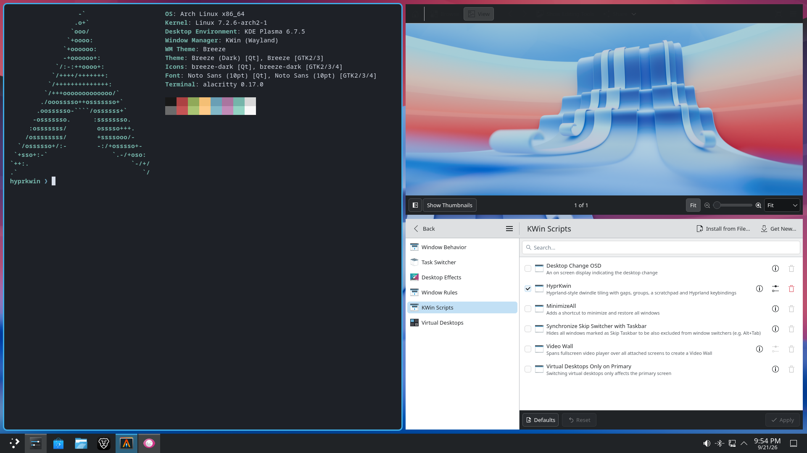

# HyprKwin

Hyprland-style dwindle tiling for KDE Plasma 6, implemented as a KWin script.
You keep all of Plasma: panels, widgets, the task manager, Overview, virtual
desktops, activities, window rules, KRunner and System Settings.



*Alacritty, Gwenview and System Settings tiled by HyprKwin on Plasma 6.7
(Breeze Dark), with the rounded focus border and the stock Plasma panel.*

- **Dwindle layout** with Hyprland's semantics: splits along the longer side,
  `gaps_in` / `gaps_out`, `default_split_ratio` (same units as Hyprland),
  `preserve_split`, `force_split`, `split_width_multiplier`, `togglesplit`,
  pseudotiling.
- **Master, monocle and scrolling layouts** as well, chosen per workspace: a
  master area with `mfact`, several masters, and the master area on any side
  or in the middle (the three-column layout); or a niri-style strip of
  columns you scroll through.
- **Workspaces = Plasma virtual desktops** (created on demand), and every
  monitor gets its own, as in Hyprland. Pager, Overview and the desktop
  switcher keep working.
- **Groups (tabbed windows)** with a clickable tab bar, like Hyprland's
  `togglegroup` / `moveintogroup` / `changegroupactive`.
- **Special workspaces (scratchpads)**: `togglespecialworkspace` and
  `movetoworkspace special`, with up to four more you name yourself.
- **Workspace rules**: pin a workspace to a monitor, say what each monitor
  starts on, and give a workspace its own layout and gaps.
- **Focus indicator** you choose: a Hyprland-style coloured border in the gap,
  optionally with rounded corners, following your colour scheme — or Plasma's
  own window decorations, or nothing.
- **Mouse**: Meta+drag a tiled window onto another to re-tile it there,
  Meta+right-drag (or drag an edge) to resize the split live. Optional
  focus-follows-mouse.
- **Window rules** in Hyprland syntax (`float, class:^(org\.kde\.kcalc)$`).
- **Multi-monitor**: every monitor gets its own workspaces, as in Hyprland —
  a second display comes up on workspace 2, and switching workspace only
  changes the monitor you are on. Directional focus, swap and move across
  monitors, plus swapping two monitors' workspaces.
- **Animations**: a companion KWin effect slides and stretches windows into
  their new tile, like Hyprland's `animations { windows }`.
- **Settings page** in System Settings › Window Management › KWin Scripts.

## Install

Requires a Plasma 6 Wayland session (developed and tested on Plasma 6.7; X11
is untested). The helper scripts also need `python3` with dbus-python
(`python-dbus` on Arch, `python3-dbus` on Debian, Ubuntu and Fedora) and
`qdbus6`.

1. **Install:**

   ```bash
   tools/install.sh
   ```

   Before changing anything, this backs up every global shortcut you have
   (to `~/.local/share/hyprkwin/shortcuts-before-hyprkwin.json`, plus a copy
   of `~/.config/kglobalshortcutsrc` beside it), so that uninstalling can put
   them all back. It then installs the script and the animations effect into
   `~/.local/share/kwin/`, enables both and starts the script.

2. **Give HyprKwin its keys.** Plasma already uses several of the
   Hyprland-style keys (Meta+Left, Meta+1…, Meta+Tab, …), and the first
   action to claim a key keeps it:

   ```bash
   tools/hyprkwin-shortcuts.py check   # see what clashes (changes nothing)
   tools/hyprkwin-shortcuts.py apply   # hand those keys to HyprKwin
   ```

   See [Keybindings and Plasma conflicts](#keybindings-and-plasma-conflicts).

3. **Log out and back in** once, so KWin picks up the animations effect (it
   only discovers new effects when it starts).

To remove it again, see [Uninstall](#uninstall).

**Upgrades apply without logging out.** Run `tools/install.sh` again and it
reloads HyprKwin in the running session. (KWin caches a script's code for as
long as it runs, so HyprKwin loads each installed version from a folder of
its own.) The one exception is the upgrade *to* 0.7 from an older version,
which needs one last logout; the installer says so when it does. Other
tiling scripts (Polonium, Krohnkite, Bismuth) must be disabled; the installer
warns if one is enabled.

### Animations

`tools/install.sh` also installs a companion effect, **HyprKwin animations**,
which animates windows into their new tile instead of snapping them there.
A KWin script cannot draw or animate anything itself, so this has to be a
separate KWin *effect*; it animates the rendered window (like KWin's own
"Stretch" effect does for maximize), so applications never see the
intermediate sizes.

Enable it under System Settings › Window Management › Desktop Effects ›
"HyprKwin animations". **KWin only discovers a newly installed effect when it
starts**, so log out and back in after the first install. Its settings
(duration, curve, what to animate) are behind the effect's configure button:

| Setting | Hyprland equivalent | Default |
|---|---|---|
| Duration | `animation = windows, 1, 4, …` | 200 ms |
| Curve | `bezier` | ease out (cubic) |
| Animate move / resize | `windowsMove` / `windowsIn`+`windowsOut` | both on |
| Animate borders and tab bars | – | on |
| Skip jumps longer than | – | no limit |
| Window open/close | `windowsIn` / `windowsOut` | leave to Plasma |

Windows animate when they change tile (opening, closing, swapping,
toggling a split).

A keyboard resize slides the divider without the usual tricks. Stretching
the apps' contents to fake the in-between sizes squashes their text, and
resizing them at every step makes Chromium and Electron apps flicker, so
each app resizes exactly once: the one that grows gets its new size at once
and is uncovered as the edge travels; the one that shrinks keeps its old size
while the edge slides over it, then resizes. The focus border moves with the
edge. While an edge is dragged with the mouse nothing animates; the
neighbours simply follow the pointer.

The slide needs this effect. Without it, turn off HyprKwin's "Slide the split
when resizing from the keyboard" setting and the divider jumps instead.

"Window open/close" picks one of Plasma's own effects (Scale, Fade, Glide) or
turns them off. KWin treats those as mutually exclusive, so choosing one here
retires the others; "Leave to Plasma" keeps whatever Desktop Effects says.

Plasma's global animation speed (System Settings › General Behavior) is
applied on top of the duration, and setting it to "Instant" disables the
animation entirely. Window open and close animations stay Plasma's own
(Scale, Glide, …, under Desktop Effects).

### Keybindings and Plasma conflicts

KDE's shortcut daemon gives a key to whichever action claimed it first, so
HyprKwin's Hyprland-style keys only work once conflicting Plasma shortcuts
(Meta+Left quick tiling, Meta+1 task manager entries, Meta+Tab, Meta+T tile
editor, zoom on Meta+= / Meta+-, …) let go of them:

```bash
tools/hyprkwin-shortcuts.py check     # list conflicts, changes nothing
tools/hyprkwin-shortcuts.py apply     # hand the keys to HyprKwin (remembered)
tools/hyprkwin-shortcuts.py restore   # give them back
```

Everything can also be rebound by hand under System Settings › Keyboard ›
Shortcuts › KWin (all entries start with "HyprKwin:").

Your own shortcuts are safe either way: before changing anything,
`install.sh` takes a snapshot of every global shortcut
(`~/.local/share/hyprkwin/shortcuts-before-hyprkwin.json`, plus a copy of
`kglobalshortcutsrc` next to it), and uninstalling puts them all back. The
snapshot is never overwritten by a later install or upgrade.

Defaults follow Omarchy's Hyprland bindings (Meta = SUPER). Shifted symbols
use the character they produce on a US layout, which is how Plasma stores
them (Shift+1 is `Meta+!`), so rebind those if you use another layout.

| Keys | Action |
|---|---|
| `Meta+Q` | Close window |
| `Meta+J` | Toggle window split (dwindle) |
| `Meta+Shift+J` | Next layout (dwindle, master, monocle, scrolling) |
| `Meta+M` / `Meta+Shift+M` | Swap window with the master / focus the master |
| `Meta+>` / `Meta+<` | One more / one fewer master window |
| `Meta+Alt+M` | Move the master area round |
| `Meta+P` | Pseudotile window |
| `Meta+T` | Toggle window floating/tiling |
| `Meta+F` | Full screen |
| `Meta+Alt+F` | Full width (maximize) |
| `Meta+O` | Pop window out (float & pin) |
| `Meta+Left` / `Right` / `Up` / `Down` | Focus window in direction (crosses monitors) |
| `Meta+Shift+Left` / `Right` / `Up` / `Down` | Swap window in direction (moves to the next monitor at the edge) |
| `Meta+-` / `Meta+=` | Move the split beside the window left / right |
| `Meta+_` / `Meta++` (Shift) | Move the split above or below it up / down |
| `Meta+Alt+…` / `Meta+Ctrl+…` with the above | Move it a little / a lot |
| `Meta+1…0` | Switch to workspace 1–10 |
| `Meta+Shift+1…0` (`Meta+!` … `Meta+)`) | Move window to workspace 1–10 and follow |
| `Meta+Shift+Alt+1…0` | Move window to workspace 1–10 silently |
| `Meta+Tab` / `Meta+Shift+Tab` | Next / previous workspace |
| `Meta+Ctrl+Tab` | Former workspace |
| `Meta+S` | Toggle scratchpad |
| `Meta+Alt+S` | Move window to / from scratchpad |
| unbound | Toggle named scratchpad 1–4, and move a window to / from it |
| `Meta+Ctrl+Shift+Left` / `Right` / `Up` / `Down` | Move window to the monitor in that direction |
| `Meta+Shift+Alt+Left` / `Right` / `Up` / `Down` | Swap this monitor's workspace with that one's |
| `Ctrl+Alt+Tab` / `Ctrl+Alt+Shift+Tab` | Focus next / previous monitor |
| `Meta+G` | Toggle window grouping |
| `Meta+Alt+G` | Move window out of group |
| `Meta+Alt+Left` / `Right` / `Up` / `Down` | Move window into group in direction |
| `Meta+Alt+Tab` / `Meta+Alt+Shift+Tab` | Next / previous window in group |
| `Meta+Ctrl+Left` / `Right` | Previous / next window in group |
| `Meta+Alt+1…5` | Switch to group window 1–5 |
| unbound | Pick a layout directly, previous layout, move the master area back, focus next/previous window in the layout, swap split halves, move window in direction (Hyprland `movewindow`), reload & retile |

Mouse: hold Meta and drag with the left button to move a window (drop it on
another tile to re-tile there, or on another monitor), or with the right
button to resize. This uses Plasma's window-action modifier (System Settings ›
Window Management › Window Behavior › Window Actions).

Alt+Tab, Meta+W (Overview), Meta+D and all other Plasma shortcuts that don't
clash stay as they are.

## Uninstall

```bash
tools/uninstall.sh
```

This:

- removes HyprKwin's own shortcuts,
- puts every global shortcut back exactly as it was before HyprKwin was
  installed, from the snapshot `install.sh` took: the keys HyprKwin moved
  aside, and any you reassigned by hand to settle a clash,
- disables and removes both the script and the animations effect,
- closes the focus-border windows, which KWin would otherwise leave on
  screen.

Your windows stay where they are and get their title bars back. No logout is
needed, and Plasma's own quick tiling and tile editor work again straight
away.

Putting the snapshot back also undoes shortcut changes you made yourself
after installing. To keep those, use `tools/uninstall.sh --keep-shortcuts`,
which only gives back the keys HyprKwin moved.

Run from a TTY with Plasma not running, it still removes HyprKwin and its
shortcuts, and tells you to run `tools/hyprkwin-shortcuts.py reinstate` once
you are logged in to put the rest back.

A few things are left in place, in case you reinstall:

- **Settings**: the `[Script-hyprkwin]` group in `~/.config/kwinrc`, plus
  `[Effect-hyprkwinanimations]` if you changed any animation settings. Delete
  those groups to forget them.
- **Virtual desktops** that HyprKwin created on demand. Remove any you don't
  want under System Settings › Window Management › Virtual Desktops.
- **Other tiling scripts** you disabled for HyprKwin (Polonium, Krohnkite, …)
  stay disabled; turn them back on under System Settings › Window
  Management › KWin Scripts.

## Configuration

System Settings › Window Management › KWin Scripts › HyprKwin › configure.

| Setting | Hyprland equivalent | Default |
|---|---|---|
| Layout | `dwindle` / `master` / scrolling (hyprscrolling) | dwindle |
| Column width (scrolling) | `hyprscrolling:column_width` | 0.5 |
| Master area size, master count, master area position | `master:mfact`, `master:orientation` | 0.55, 1, left |
| New windows become the master | `master:new_status` | off |
| Inner / outer gaps | `general:gaps_in` / `gaps_out` | 5 / 10 |
| Default split ratio | `dwindle:default_split_ratio` | 1.0 |
| Split width multiplier | `dwindle:split_width_multiplier` | 1.0 |
| New window goes | `dwindle:force_split` | right / bottom |
| Preserve split | `dwindle:preserve_split` | on |
| No gaps when only | `workspace = w[tv1], gapsout:0, gapsin:0` | off |
| Focused window shown by | title bars / `general:border_size` | coloured border |
| Border size | `general:border_size` | 2 px |
| Corner radius | `decoration:rounding` | 0 (square) |
| Focused / unfocused border colour | `col.active_border`, `col.inactive_border` | follow the colour scheme |
| Focused border as a gradient (two colours and an angle) | `col.active_border = rgba(33ccffee) rgba(00ff99ee) 45deg` | off |
| Turning the gradient | `animation = borderangle, …` | off (0°/s) |
| Focused / unfocused window opacity | `decoration:active_opacity`, `inactive_opacity` | 1.0 (untouched) |
| Group tab bar height | `group:groupbar:height` | 22 |
| Focus follows mouse | `input:follow_mouse = 1` | off |
| Start each session on workspace 1 | – | on |
| Every monitor has its own workspaces | one workspace per monitor | on |
| Go to a window that asks to be activated | `misc:focus_on_activate` | on |
| Closing a window focuses its neighbour | – | on |
| Slide the split when resizing from the keyboard | `animation = windows` (for resizes) | on (needs the effect) |
| Create workspaces on demand | – | on |
| Drop a dragged window to re-tile | `dwindle:use_active_for_splits` (roughly) | on |
| Tile dialogs and utility windows | `windowrule = tile, …` per app | off |
| Hide title bars on floating windows too | – | off |
| Scratchpad margin | – | 40 px |
| Extra scratchpads | `special:name` workspaces | none |
| Workspace rules | `workspace = …` | see [Workspace rules](#workspace-rules) |
| Window rules | `windowrule = …` | see [Window rules](#window-rules) |

Border colours follow the colour scheme by default: the accent colour marks
the focused window and the scheme's dimmed colour the rest, so they change
with your Plasma theme. Either can be set to a fixed colour instead, and the
focused one to a gradient between two colours at any angle, the way
Hyprland's `col.active_border` takes two colours and `45deg`. The gradient can
turn around the border as Hyprland's `borderangle` animation does; it is off
by default, since it redraws the border continuously.

Settings apply as soon as you press OK or Apply: Plasma doesn't notify
scripts about their settings, so HyprKwin notices the change to `kwinrc` and
asks KWin to reload its configuration.

### Workspaces and monitors

Hyprland gives every monitor its own workspaces; KWin's virtual desktops are
global. HyprKwin emulates Hyprland's model on top of them:

- A second display comes up showing workspace 2 (a third shows 3, and so on),
  creating the desktop if it does not exist yet.
- `Meta+1…0` switches only the monitor you are on. If that workspace is
  already up on another monitor, focus jumps there instead — a workspace
  lives on one monitor at a time.
- So `Meta+Shift+2` sends a window to whichever monitor is showing workspace
  2: with two displays that is the everyday "put this over there".
  `Meta+Ctrl+Shift+arrow` moves a window to a monitor directly, and at the
  edge of a screen `Meta+Shift+arrow` carries a window across too.
- `Meta+Shift+Alt+arrow` swaps two monitors' workspaces, windows and all.
- Monitors can come and go mid-session: plug one in (or switch it on) and it
  takes the next free workspace straight away. Unplug it and its windows move
  across but keep their workspace, so plugging it back in puts them where
  they were. No need to log out.

The one seam this leaves: Plasma only has one current desktop, so windows the
other monitors are showing are marked "on all desktops" to keep them up. They
show as pinned in the task manager and the pager puts everything you can see
on the current desktop. Turn the setting off to go back to plain Plasma
behaviour, where a workspace spans every monitor.

### Focus after closing a window

Close a window and the focus goes to the one that takes its place: the other
side of the split it shared, or the next tab if it was in a group. When two
windows could take over, the one you used more recently wins.

Plasma on its own picks the window you used longest ago, wherever it is, so
closing a window on the left can land you in the bottom-right corner. Turn
"Closing a window focuses the neighbour that takes its place" off in the
settings to go back to that.

### Relaunching an app that is already open

Launch an app that is already open on another workspace and HyprKwin takes you
there — its workspace comes up on the monitor it lives on, and a minimized
window is restored. Plasma on its own only flags the window: its focus
stealing prevention turns down an app's request to come forward whenever you
have been typing or clicking elsewhere.

A script cannot tell "I was launched again" from "I have a new message": chat
apps ask for attention the same way. If one keeps pulling you over, opt it out
with a rule (it then just flags itself in the taskbar, as in plain Plasma):

```
focusonactivate off, class:^(discord|vesktop|org\.telegram\.desktop)$
```

### Layouts

Three layouts, each workspace with its own:

- **Dwindle** (the default), Hyprland's: every new window splits the one it
  lands on, along its longer side.
- **Master**: a master area beside a stack. The master area can take any share
  of the screen (`mfact`), hold several windows, and sit on any side or in the
  middle, which gives the three-column layout.
- **Monocle**: one window at a time, each filling the workspace, with
  everything else behind it.
- **Scrolling**: a strip of columns, as in niri or hyprscrolling. Moving the
  focus scrolls the strip, and the resize keys widen or narrow the focused
  column. Only whole columns are shown; the ones out of view wait past the
  last monitor, so nothing ever spills onto the screen next door.

In the scrolling layout, `Meta+Left` / `Meta+Right` move along the strip and
`Meta+Shift+Left` / `Meta+Shift+Right` move the column itself, rather than
going by what is where on screen.

`Meta+Shift+J` moves the current workspace to the next layout; there are also
shortcuts to pick one directly. In the master layout, `Meta+M` swaps the
focused window with the master, `Meta+Shift+M` focuses the master,
`Meta+>` / `Meta+<` change how many windows are masters, and `Meta+Alt+M`
moves the master area round. The resize keys and dragging the edge move the
boundary between the master area and the stack, exactly as they move a
dwindle split.

The layout of a workspace lasts as long as the session; the setting decides
what a workspace starts with.

Changing the layout, or the split direction on `Meta+J`, puts a short message
on screen naming what it changed to, in the manner of Plasma's own on-screen
display, framed in the focus border's colours. Turn it off with "Show a
message when the layout or split changes".

### Scratchpads

`Meta+S` shows and hides the scratchpad, and `Meta+Alt+S` puts the focused
window into it or takes it back out — Hyprland's `togglespecialworkspace` and
`movetoworkspace special`.

For more than one, name them in the settings page under **Extra scratchpads**:
the first name is scratchpad 1, the second scratchpad 2, and so on, up to
four. Their keys are unbound by default — set them in System Settings >
Keyboard > Shortcuts > KWin, under "HyprKwin: Toggle scratchpad 1". A window
goes into one with the matching move key, or with a rule:

```
workspace special:music, class:^(spotify)$
```

Only one scratchpad is on screen at a time, as in Hyprland: opening one puts
the other away.

### Focus indicator

KWin can only switch a window's *whole* decoration on or off (`noBorder`);
there is no way to keep the frame and drop the title bar. So the two useful
styles are exclusive, and you pick one in the settings:

- **Coloured border** (default) — title bars are hidden for every tiled window
  and a border is drawn in the gap, like Hyprland's `col.active_border`. This
  looks the same for every app, which is its main advantage: it does not care
  whether an app uses server- or client-side decorations. It costs a few thin
  overlay windows per border, since KWin scripts have no other way to draw on
  screen. Floating windows get the border too when they have no title bar
  (hidden with "Hide title bars on floating windows too", or an app that
  draws its own), and a border steps aside wherever a menu or a window stacked
  above would otherwise have it painted across it.
- **The window decoration** — HyprKwin leaves decorations alone and the
  decoration marks the focused window, creating no overlay windows at all.
  With a normal theme that means a title bar on every tile; a *frame-only*
  Aurorae theme gives the Hyprland look instead (see below). The catch is that
  Chromium/Electron/GTK apps decorate themselves, so no theme can mark them —
  HyprKwin fills those in with its own border.
- **Nothing** — title bars hidden, no border. Pair it with KWin's built-in
  *Dim Inactive* effect (System Settings › Desktop Effects) if you still want
  a focus cue without overlays.

#### Hyprland-style borders without overlays

Aurorae decoration themes can have `TitleHeight=0`, i.e. a frame and no title
bar. [Active Accent](https://github.com/nclarius/Plasma-window-decorations) by
Natalie Clarius does exactly that: its **Frame** flavour draws the accent
colour around the active window and the background colour around inactive
ones. Combined with "The window decoration" above, that gives Hyprland's
`col.active_border` look with zero overlay windows:

1. System Settings › Colors & Themes › Window Decorations › *Get New Window
   Decorations…* › search "Active Accent" › install **Active Accent Frame**
   (or copy the theme folder into `~/.local/share/aurorae/themes/`).
2. Select it, and keep Window border size at a normal value — the border *is*
   the indicator.
3. Set "Focused window shown by" to *The window decoration*.

The frame adds a few pixels around each window, so you may want smaller
`gaps_in`. Aurorae cannot draw borders on maximized windows, which does not
affect tiled windows (HyprKwin unmaximizes them).

**Apps that decorate themselves.** Chromium, Electron (Brave, VS Code, Claude
Desktop, Discord…) and most GTK apps draw their own frames on Wayland, so
KWin has no decoration to paint for them and *no* decoration theme can mark
them as focused. With "With decorations, still draw a border on apps that
decorate themselves" (on by default), HyprKwin draws its own border around
exactly those windows, so focus looks the same everywhere. Chromium-based
browsers can often be switched to server-side decorations in their own
settings ("Use system title bar and borders"), which hands them back to the
theme.

### Window rules

Window rules live in HyprKwin's settings: System Settings › Window
Management › KWin Scripts › HyprKwin (configure) › **Window rules**. They form
a list you can add to, edit, remove from and reorder, with a reference of
every action and matcher beside it. Press Apply and they take effect for
windows opened from then on.

Rules use Hyprland's syntax (a leading `windowrule =` is accepted, so lines
can be pasted from `hyprland.conf`): an action, then what to match.

```
float, class:^(org\.kde\.kcalc)$
size 800 600, floating:1, class:^(org\.pulseaudio\.pavucontrol)$
center, floating:1, class:^(org\.pulseaudio\.pavucontrol)$
workspace 3 silent, class:^(discord)$
monitor 1, class:^(spotify)$
opacity 0.95 0.85, class:^(Alacritty)$
tile, class:^(steam)$, title:^Steam$
```

| Action | Does |
|---|---|
| `float` / `tile` | never / always tile the window |
| `pseudo`, `fullscreen`, `maximize`, `pin`, `group` | open it that way |
| `special [name]` | send it to the scratchpad, or to a named one |
| `workspace special:name` | the same, in Hyprland's own spelling |
| `workspace N [silent]` | open it on workspace N (and stay where you are with `silent`) |
| `size W H`, `move X Y`, `center` | place a floating window; pixels or a percentage of the monitor |
| `monitor N` or `monitor DP-2` | open it on that monitor (counting from 0, as in Hyprland) |
| `opacity A [I]` | opacity while focused (and while not) |
| `noborder` | no border and no title bar |
| `focusonactivate [on\|off]` | whether it may pull you to it when it asks for attention |

Match on `class:` (the Wayland app id or X11 class) and `title:`, both
regular expressions, and on `floating:1` or `floating:0`. The first rule that
matches wins, for each kind of action. `float` is the one you want for apps
that manage their own windows (virtual machines, games, image editors).
Dialogs, transient windows, fixed-size windows and Plasma's own system
windows (polkit prompts, KRunner, Spectacle, the file-chooser portal, …)
float anyway.

**Finding an app's class:** in System Settings › Window Management › Window
Rules, add a rule and use *Detect Window Properties*, then click the window.
From a terminal, the helper lists your open windows and writes the rule for
you. It edits the same list the settings page shows:

```bash
tools/hyprkwin-rules.py list        # number every open window
tools/hyprkwin-rules.py float 3     # never tile that app
tools/hyprkwin-rules.py tile 3      # always tile it
tools/hyprkwin-rules.py show        # what is set
tools/hyprkwin-rules.py remove 2    # drop one
```

### Workspace rules

Rules for the workspaces themselves, in Hyprland's own syntax, set in the
settings page's **Workspace rules** tab:

```
workspace = 3, monitor:DP-2, default:true
2, layout:master, gapsin:0, gapsout:0
```

| Property | Does |
|---|---|
| `monitor:N` or `monitor:DP-2` | keep that workspace on that monitor: switching to it goes there, and a window sent to it follows |
| `default:true` | the workspace that monitor starts the session on |
| `layout:dwindle\|master\|monocle\|scrolling` | the layout it starts with; `Meta+Shift+J` still changes it afterwards |
| `gapsin:N`, `gapsout:N` | gaps for that workspace alone |

The `workspace = ` prefix is optional, so lines can be pasted straight out of
a `hyprland.conf`. The first rule for a workspace wins on each property, and a
rule with something wrong with it is reported rather than guessed at.

## How it fits into Plasma

- Tiled windows get their title bar hidden (optional); floating windows keep
  it. Unloading the script restores everything.
- Minimizing a tiled window gives its space to its neighbours; restoring it
  puts it back where it was. Windows on another activity are treated the same
  way.
- Moving a window with Plasma (task manager, pager, "Window to Desktop",
  "Window to Next Screen", dragging) re-tiles it in its new place, and a
  window that lands on another monitor joins the workspace that monitor is
  showing.
- Switching desktop from Plasma itself (the pager, its own shortcuts) applies
  to the monitor you are on, leaving the others as they were.
- Maximize and fullscreen are Plasma's own states; the window keeps its tile
  and returns to it.
- Plasma's quick tiling (Meta+arrows before the shortcuts are reassigned) and
  the tile editor can't take over a HyprKwin-tiled window: HyprKwin takes it
  back. Floating windows can still use them.
- Borders and tab bars stay out of the task manager, Alt+Tab and Overview,
  and hide while Overview, Window View or Cube is open.
- The scratchpad is ordinary minimize/restore plus "keep above", so its
  windows stay visible in the task manager while hidden.

## Limitations

- KWin scripts cannot move the mouse pointer, so there is no
  "cursor follows focus" / `cursor:warp_on_change_workspace`.
- In the scrolling layout, columns hold a single window; niri's stacking of
  several windows in one column is not there yet.
- Windows themselves are not rounded, only the border around them
  (`decoration:rounding` rounds the window in Hyprland). A scripted effect can
  load a fragment shader, but applying one to a window renders it black, so
  this needs a compiled effect: the third-party
  [Shape Corners](https://github.com/matinlotfali/KDE-Rounded-Corners) does it.
- Animations come from a companion KWin effect, which cannot resize an app
  smoothly; see [Animations](#animations) for how resizes are handled.
- Every monitor having its own workspaces is emulated on top of Plasma's
  single current desktop, so windows shown on the other monitors appear
  "on all desktops" in the task manager and pager.
- Scripts can't bind mouse wheel shortcuts, so there's no Meta+scroll
  workspace switching.
- KWin does not destroy a script's overlay windows when the script is
  unloaded; HyprKwin closes any leftovers when it next starts, and
  `uninstall.sh` sweeps them.

## Development

```
package/
  metadata.json                KWin script metadata (declarative script)
  contents/code/engine.js      pure dwindle tree: layout, gaps, splits, groups, resize, directions
  contents/code/rules.js       Hyprland window-rule parser
  contents/code/driver.js      binds the engine to KWin (spaces, windows, actions)
  contents/code/shortcuts.js   default shortcuts
  contents/ui/main.qml         entry point: loads the installed build (so upgrades apply without logging out)
  contents/ui/HyprKwin.qml     the script: shortcuts, timers, overlays
  contents/ui/Border.qml, BorderStrip.qml, GroupBar.qml
  contents/ui/config.ui        settings page (+ contents/config/main.xml)
tests/
  *.test.js                    Deno unit tests for engine.js / rules.js
  e2e/                         end-to-end tests in a headless nested KWin
tools/                         install, uninstall, shortcut conflicts, docs helper
```

Unit tests:

```bash
deno test --allow-read tests/
```

End-to-end tests start a private `kwin_wayland --virtual` (own D-Bus session
and config dir, nothing touches your desktop), install the package into it
and drive it with real key presses and mouse drags through KWin's
fake-input protocol. One test also runs a real `plasmashell`. They need
`python3` with PySide6, dbus-python and Pillow, plus `spectacle` (for
screenshots) and `kscreen-doctor` (for plugging monitors in and out).

```bash
python3 tests/e2e/run.py            # everything
python3 tests/e2e/run.py groups     # tests whose name contains "groups"
```

The screenshot at the top is staged in the same nested KWin, with real apps
and a real Plasma panel, so it can be retaken when the UI changes:
`python3 tools/readme-screenshot.py` (needs Alacritty, Gwenview and fastfetch).

Debug logging: enable "Debug logging" in the settings, then
`journalctl --user -f | grep HyprKwin`.
